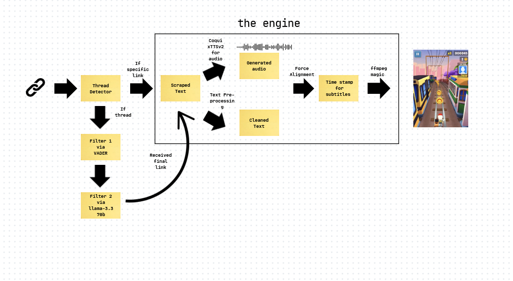

# Open Brain Rot


> A TikTok-style content generator that transforms Reddit posts into viral-worthy videos with AI-generated voiceovers and synchronized subtitles.

## 🎬 Demo

[](https://youtube.com/shorts/CRhbay8YvBg)

## 🧠 What is Brain Rot?

"Brain rot" content refers to those addictive, short-form videos that flood social media platforms like TikTok - designed to be consumed rapidly and keep you scrolling. This project automates the creation of such content by:

1. Scraping content from Reddit
2. Transforming it into exaggerated, attention-grabbing monologues
3. Converting text to speech with realistic TikTok-style voiceovers
4. Generating perfectly synchronized subtitles
5. Packaging everything into a ready-to-upload video

## ✨ Features

-   **Web Interface**: Simple UI to generate videos with just a Reddit URL
-   **Thread Analysis**: Uses VADER sentiment analysis and LLaMA 3.3 70B to select the most engaging Reddit threads
-   **AI Voice Generation**: Leverages Coqui's xTTSv2 for realistic TikTok-style voiceovers
-   **Perfect Subtitle Sync**: Employs Wav2Vec2 for precise forced alignment between audio and text
-   **Customizable**: Use your own background videos and voice samples

## 🔍 How It Works



### Pipeline:

1. **Input Processing**: Determines if the input is a thread or direct link
2. **Content Scraping**: Extracts content from Reddit using their API
3. **Brainrot Transformation**: Converts formal content into exaggerated TikTok-style monologues
4. **Voice Synthesis**: Generates realistic speech from the transformed text
5. **Forced Alignment**: Creates perfectly timed subtitles that match the audio
6. **Video Generation**: Combines background video, audio, and subtitles into the final product

## 🚀 Getting Started

### Prerequisites

-   Python 3.8+
-   PyTorch (with CUDA 12.4 for GPU acceleration)
-   [Coqui TTS](https://github.com/coqui-ai/TTS)
-   [FFmpeg](https://www.ffmpeg.org/)
-   Groq API key (for LLM features)

### Installation

1. Clone the repository:

    ```bash
    git clone https://github.com/compute-labs-dev/Open-Brainrot.git
    cd Open-Brainrot
    ```

2. Set up a virtual environment (recommended):

    ```bash
    python -m venv venv
    source venv/bin/activate  # On Windows: venv\Scripts\activate
    ```

3. Install dependencies:

    ```bash
    pip install torch torchaudio transformers requests python-dotenv
    pip install TTS
    ```

4. Create a `.env` file with your API keys:
    ```
    GROQ_API_KEY=your_groq_api_key_here
    ```

## 📁 Required Files and Directories

Before running the application, you need to create the following directory structure and example files:

### Directories

-   `assets/` - For storing background videos and voice samples
    -   Place your background video as `subway.mp4` here
    -   Place your voice sample as `default.mp3` here
-   `audio/` - For storing generated audio files
-   `final/` - For storing the final output videos
-   `texts/` - For storing text files during processing
    -   Create example files with `*_example.txt` and `*_example.ass` naming pattern

### Example Files

Create these example files to understand the expected format:

-   `texts/input_example.txt` - Example input text
-   `texts/brainrot_example.txt` - Example transformed text
-   `texts/subtitle_example.ass` - Example subtitle file

### Environment File

-   `.env` - Create this file in the root directory with your API keys:
    ```
    GROQ_API_KEY=your_groq_api_key_here
    ```

The application will automatically create the following files during processing:

-   `texts/scraped_url.txt` - Scraped content from Reddit
-   `texts/processed_output.txt` - Intermediate processed text
-   `texts/oof.txt` - Final processed text
-   `texts/brainrot_output.txt` - Text transformed into brainrot style
-   `texts/testing.ass` - Generated subtitle file
-   `audio/output.wav` - Generated speech
-   `audio/output_converted.wav` - Processed speech for alignment
-   `final/final.mp4` - Final output video

### Usage

Run the application from the command line:

```bash
python3 -c "from main import main; main('', llm=False, scraped_url='texts/scraped_url.txt')"
```

This command will:

1. Import the main function from main.py
2. Run the pipeline with an empty URL (no scraping)
3. Use the content from texts/scraped_url.txt as input
4. Generate the final video at final/final.mp4

## 🛠️ Project Structure

-   `main.py`: Core pipeline orchestration
-   `scraping.py`: Reddit content extraction
-   `brainrot_generator.py`: Content transformation using LLMs
-   `audio.py`: Text-to-speech conversion
-   `force_alignment.py`: Subtitle synchronization
-   `video_generator.py`: Final video assembly
-   `server.py`: Web interface

## 🙏 Acknowledgments

-   [Motu Hira's Forced Alignment Tutorial](https://pytorch.org/audio/main/tutorials/forced_alignment_tutorial.html) for the subtitle synchronization technique
-   [Coqui TTS](https://github.com/coqui-ai/TTS) for the text-to-speech capabilities
-   [Reddit API](https://www.reddit.com/dev/api/) for content access
-   The r/learnmachinelearning and r/machinelearning communities for their support

## 📄 License

This project is licensed under the MIT License - see the [LICENSE.md](LICENSE.md) file for details.

---

<p align="center">
  <i>Forked by <a href="https://github.com/compute-labs-dev">Compute Labs</a></i><br>
  <i>Original by <a href="https://github.com/harvestingmoon">@harvestingmoon</a></i>
</p>
